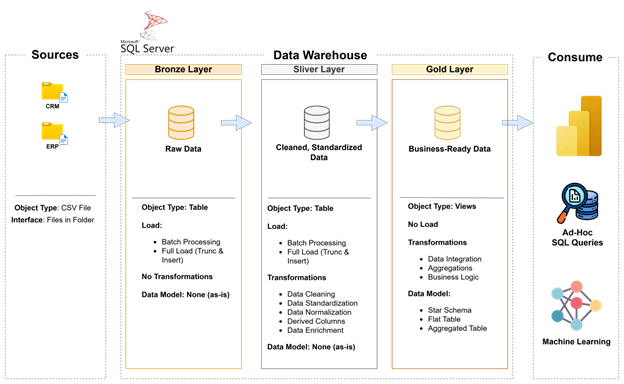
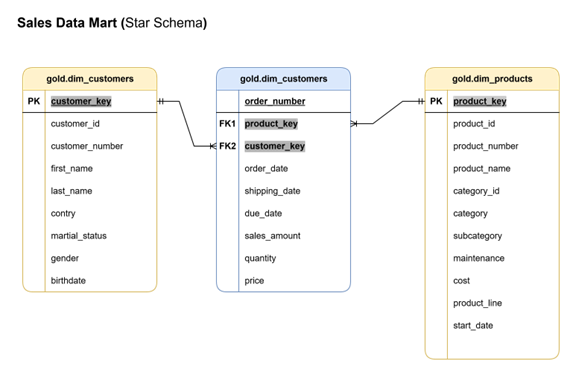

# 🧱 Sales Data Warehouse (SQL Server Project)

This project showcases a modern layered Data Warehouse built using SQL Server, following the **Medallian Architecture** (Bronze–Silver–Gold Layers).

It is designed to demonstrate real-world data engineering practices, including loading, transformation, schema design, and preparation for analytical reporting.

---

## 🎯 Project Objectives

- Consolidate sales data from ERP and CRM source systems (CSV)
- Design a structured ETL process using SQL Stored Procedures
- Implement Star Schema modeling (Dimensional Modeling)
- Build a strong analytical layer (Views) for BI tools

---

## 🧱 Architecture Overview

### 🔄 Layered Structure

This project follows a modern layered architecture approach commonly used in Data Engineering. The goal is to separate raw data from cleaned and modeled data for better maintainability, scalability, and traceability.

**Layer Descriptions:**

- 🟫 **Bronze Layer**: Raw data ingested as-is from CSV files (ERP & CRM). No transformation is applied.
- 🥈 **Silver Layer**: Cleaned and transformed data. Standardized formats, cleaned nulls, and basic business rules applied.
- 🥇 **Gold Layer**: Final presentation layer. Data modeled in a Star Schema using views (`dim_customers`, `dim_products`, `fact_sales`) ready for analytics and reporting.

---

## 🗂️ Project Structure

| Folder | Description |
|--------|-------------|
| `/docs/` | Architecture diagrams and schema designs |
| `/data_sources/` | CSV files from ERP and CRM |
| `/bronze/` | Scripts to create and load Bronze staging tables |
| `/silver/` | Transformation logic and cleaned tables |
| `/gold/` | Star Schema views for reporting |

---

## 🧠 Data Model

**Fact Table**
- `fact_sales`

**Dimension Tables**
- `dim_customers`
- `dim_products`

---

## ⚙️ ETL Logic (Stored Procedures)

- `proc_load_bronze.sql`: Loads ERP/CRM data into staging
- `proc_load_sliver.sql`: Cleans and prepares Silver Layer
- `ddl_gold.sql`: Creates final Gold Layer views

---

## 💡 Technologies Used

- SQL Server 2019
- T-SQL (Stored Procedures, Views)
- CSV File Integration
- Dimensional Modeling
- Medallian Architecture (Bronze–Silver–Gold) 
---

## 📈 Future Improvements

- Integrate Power BI reports
- Add more dimensions: Time, Region
- Add data quality validation

---

## 🙋‍♂️ About Me

**Osman Daw-Elbait** – Data Engineer  
🎓 CDMP | Microsoft Azure Data Engineer  
📫 Connect on [LinkedIn](https://www.linkedin.com/in/osman-daw-elbait)

